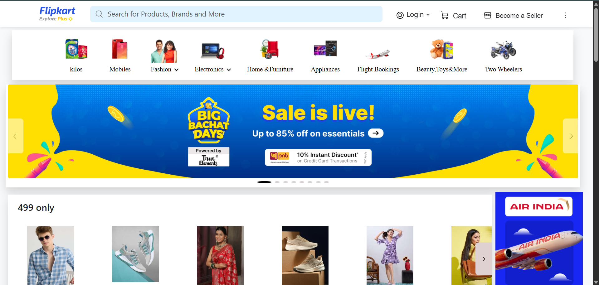
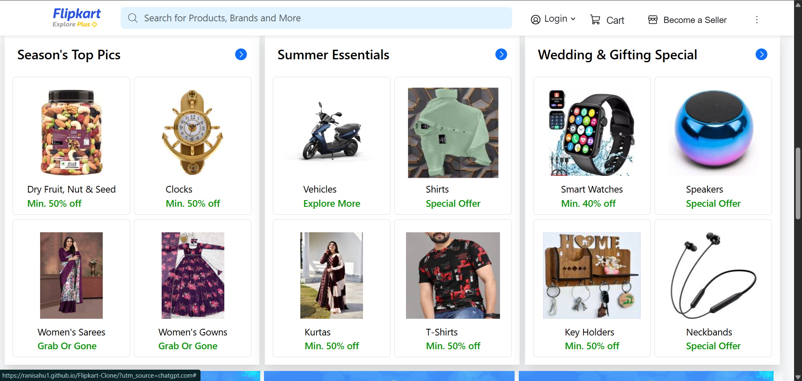
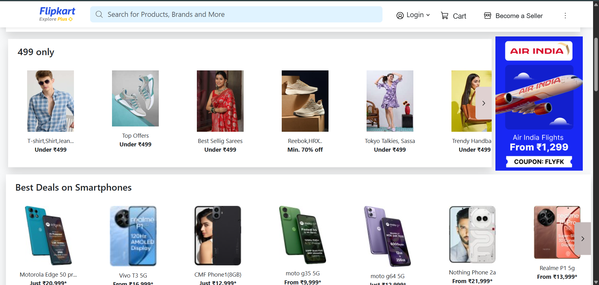

# Flipkart Clone 🛒

A front-end clone of the Flipkart homepage built using **HTML, CSS, and Bootstrap**.  
This project replicates the design and layout of Flipkart’s homepage, including navigation, categories, and product sections.

🔗 **Live Demo**: [Click here](https://ranisahu1.github.io/Flipkart-Clone/)

---

## 📸 Screenshots

  
  
  
  

---

## ✨ Features
- Responsive navigation bar with dropdown categories  
- Product sections styled like Flipkart  
- Carousel/slider for offers (if added)  
- Footer with useful links  
- Clean UI using Bootstrap grid system  

---

## 🛠️ Technologies Used
- **HTML5**  
- **CSS3**  
- **Bootstrap 5**  

---

